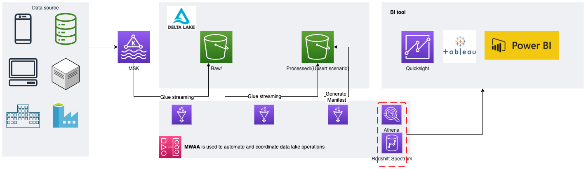

# Deltalake with Glue PoC DEMO

## Introduction

This repo is intended to deploy a sample environment that will be used to demonstrate the way to utilize Delta lake on top of *AWS Glue* in order to handle streaming data with ACID transactions. *AWS Glue* is an AWS managed service that offers users a way to easily set up Spark environment to do ETL jobs. With the convenience of *AWS Glue* and powerful ACID-compatible features of Opensource Delta lake, users are provided with a very attractive alternatives to easily build large-scale and database-like data lake. On one hand, large sum of unstructured or semi-structured data can be fed into such data lake solution and on the other hand, data lake operators do not need to manually maintain or operate the underlying infrastructure. The superiority of Glue-Delta-lake solution would greatly resolve traditional data lake pain points and hopefully this PoC demo would pave the way to building enterprise-grade data lake in such way.

## Architecture



## Prerequisite

* Understanding of AWS and intermediate knowledge about Kafka, AWS Glue, opensource Deltalake and Spark

* A valid AWS account (Both AWS Global and AWS China accounts are supported)

* Admin right to the AWS account

* [AWS CLI](https://docs.aws.amazon.com/cli/latest/userguide/getting-started-install.html)

* [Configure the admin right profile on AWS CLI](https://docs.aws.amazon.com/cli/latest/userguide/cli-chap-configure.html)

* Set up [Terraform](https://www.terraform.io/downloads)

## Setup

### Step 1

Execute the following command to download the source code:

```sh
git clone --depth=1 https://github.com/wei-zhong90/deltalake-aws-poc-demo.git
```

### Step 2

Modify the terraform input variable values to suit your own need

```sh
cd deltalake-aws-poc-demo/infrastructure
vim example.auto.tfvars
```

In the text editor screen, you will see several variables to fill in. Please pay attention to the public key variable. This variable should contain a RSA key that will be used to ssh into the sample linux instance, through which users will be able to generate sample data and do some customized tests.

### Step 3

Deploy the terraform code

```sh
terraform apply
```

Actually the terraform codes accept many more input variables than the ones listed in `example.auto.tfvars`. I only put the required ones in `example.auto.tfvars`. For instance, users can also customize some variables to avoid creating a brand new VPC environment for the PoC architecture and use the existing VPC.

### Step 4

Once `Step 3` successfully finished, users can log in to the newly deployed linux instance and will find this git repo already downloaded under the home directory. Now modify the `.env` file to point the sample data generator to the correct Kafka cluster.

```sh
vim .env
```

The *BOOTSTRAP_SERVERS* value can be found at the output values from `Step 3`. As for *TOPIC* and *SECOND_TOPIC* variables, you simply need to fill in the same values that have been filled in the previous step (*kafka_test_topic* and *kafka_test_topic_2* in `example.auto.tfvars`). Then that is it. Now we can officially start the data generator and validate the whole Deltalake-Glue architecture.

```sh
python3 -m pip install -r requirements.txt
python3 generator.py
```

## Disclaimer

The code in this repo is for demo purpose. There are still a lot of improvement can be made, especially regarding to the Terraform codes. If you find any bugs or inconvenient errors, please feel free to report it to me <weiaws@amazon.com> and my colleage, Nick <huxiaod@amazon.com>.
Do not use this code directly on prod environment by any chances.